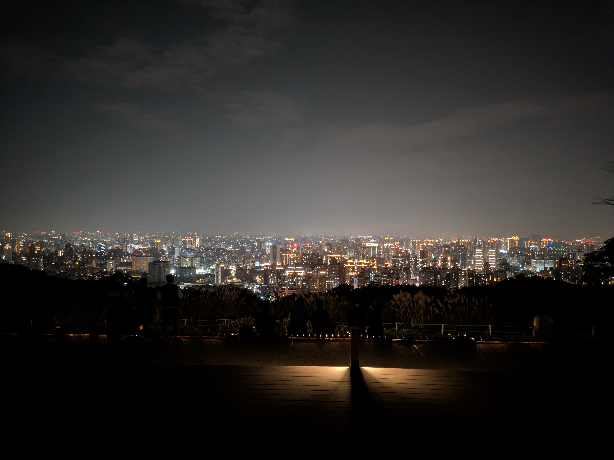

### 📸 Gallery

  <!--  -->
  

### 📝 Notes
趁著週末與爸爸和阿姨來到桃園虎頭山走走。山林步道舒適但有點人潮。晚餐選擇在評價極高的「浮島虎山」用餐，口味不太符合我的喜好且有點貴。飯後步行上山，晚上的虎頭山徹底安靜下來，若沒有人同行還真的不敢一個人走。之後開車至環保公園，在晚風中俯瞰桃園璀璨的夜景。

### 📚 Info
- 🏔️ 桃園虎頭山
- ☕ [浮島虎山 | Söt Café Bistronömy](https://maps.app.goo.gl/4M3FQk4bP3PLNcqR6)
- 🌄 [虎頭山環保公園](https://maps.app.goo.gl/AmjTiLP8YDbbA4Yb8)
- 🚗 自駕

