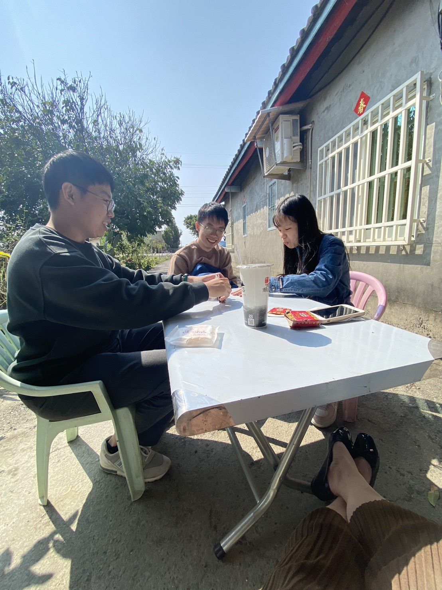
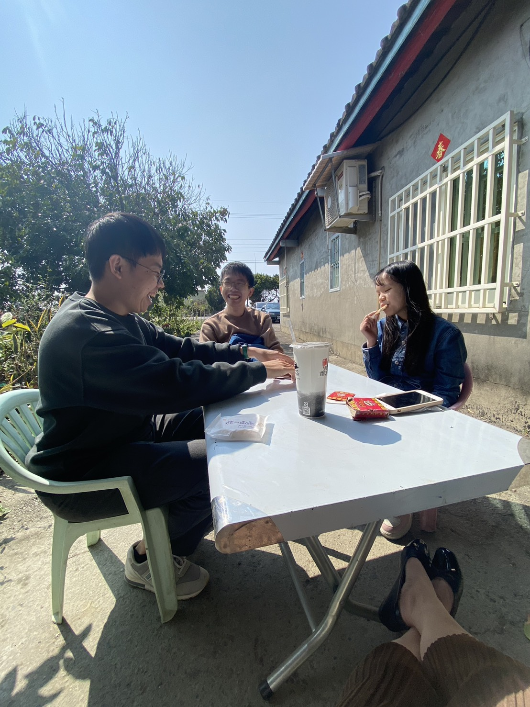

### 📸 Gallery

  <!--  -->
  

  <!--  -->
  
  

### 📝 Notes

農曆新年放假，家人先一步回去了，我則多等了兩天才自己騎機車回老家。

今年是自己工作的第一年，最後思考後包了紅包給直系長輩與後輩，不得感嘆我居然是第一個包紅包的孫子。

大年初二照例回媽媽的娘家，然後例行陪小舅舅的女兒玩遊戲，這件事延續好久好久了，以前會覺得煩，但看著從小小朋友到現在都讀國中了，或許再過幾年就不會再這樣纏著我們兄弟倆了，想到反而開始會懷念了。

### 📚 Info
- 📍 台中大安區

