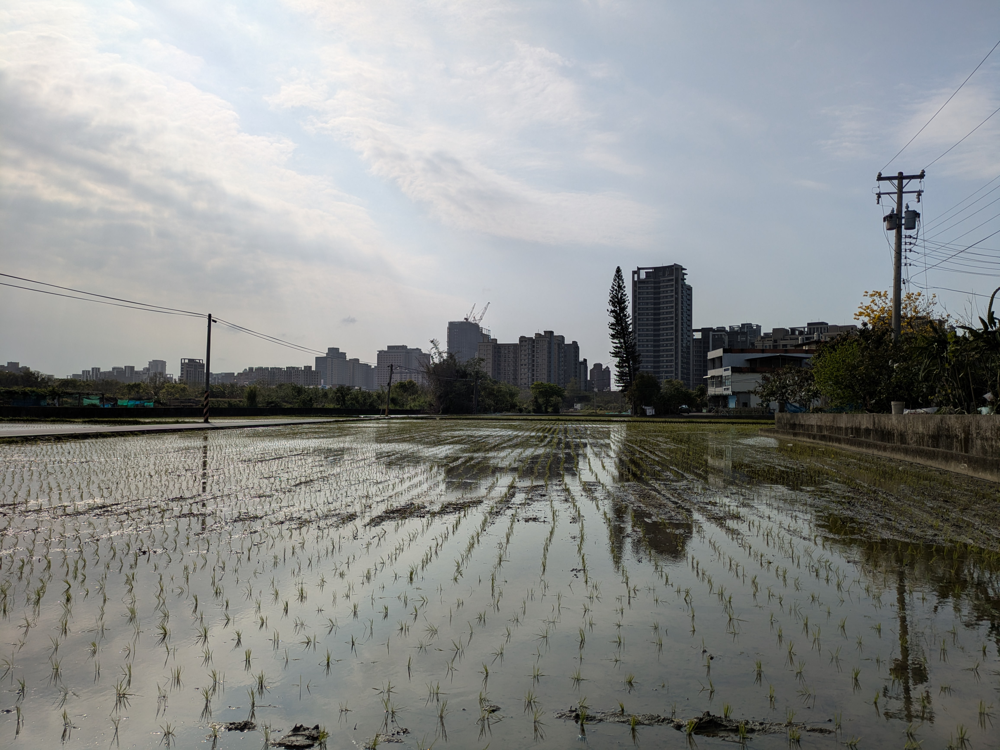
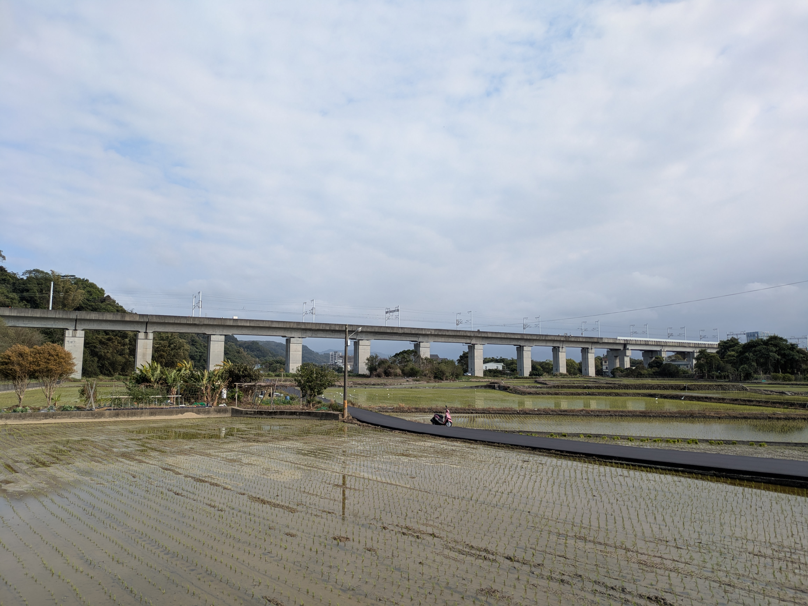
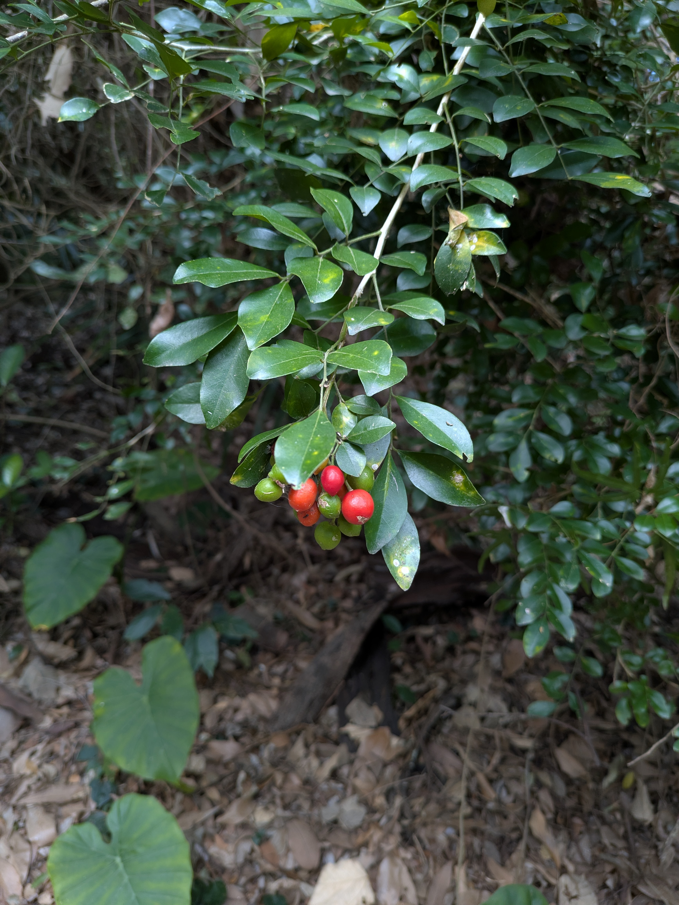

### 📸 Gallery

  <!--  -->
  

  <!--  -->
  

  <!--  -->
  

  <!--  -->
  

  <!--  -->
  

  <!--  -->
  

  <!--  -->
  

  <!--  -->
  

  <!--  -->
  

  <!--  -->
  

  <!--  -->
  

  <!--  -->
  

  
  
  
  
  
  
  
  
  
  
  
  
  
  
  
  
  
  
  
  
  
  
  

### 📝 Notes

這次一樣是單人步行，不過有別於過往騎車到文山步道入口，這次我從家裡出發，繞路繞開施工點，在切回到蓮華巷，從南側上犁頭山。一路一直走來到三段崎，才從公路一路蜿蜒下山，回到家。

<!--  -->

### 📚 Info
- 📍 竹北-犁頭山

