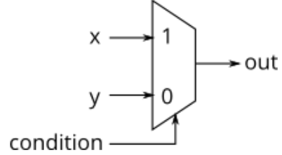

## 📌 Introduction


### Always if
```verilog
always @(*) begin
    if (condition) begin
        out = x;
    end
    else begin
        out = y;
    end
end
```

### Continuous assignment
```verilog
assign out = (condition) ? x : y;
```
## 🧑‍💻 Code Example
Problem: Choose b if both sel_b1 and sel_b2 are true. Otherwise, choose a.
```verilog
module top_module(
    input a,
    input b,
    input sel_b1,
    input sel_b2,
    output wire out_assign,
    output reg out_always   ); 
    
    assign out_assign = (sel_b1 & sel_b2) ? b : a;
    
    always @ (*) begin
        if (sel_b1 & sel_b2)
            out_always = b;
        else
            out_always = a;
    end
        
endmodule
```

## 📚 Reference
* [HDLBits Problem - Always if](https://hdlbits.01xz.net/wiki/Always_if)
