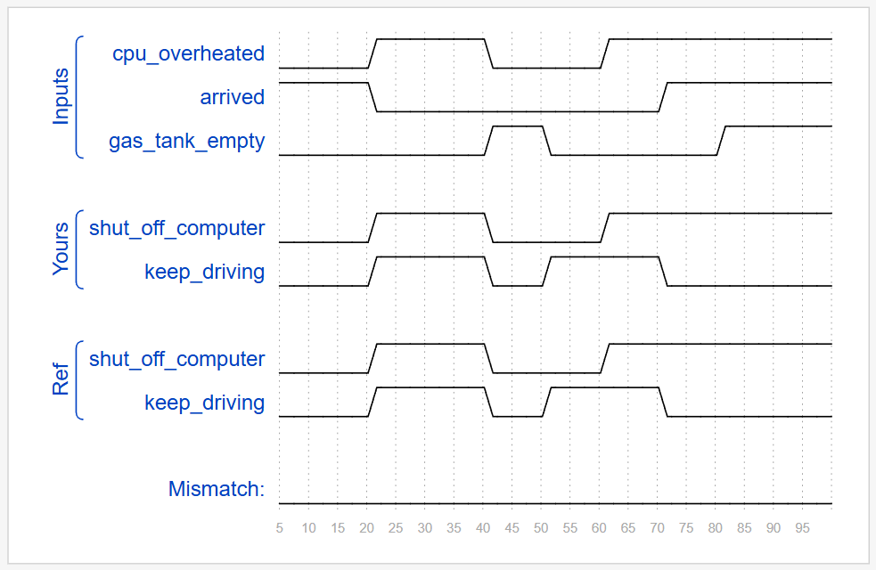

## 📌 Introduction

### Simple Explain: Latch vs Flip-Flop

* Latch (Level-sensitive)
```
Enable=1 → Q = D  
Enable=0 → Q maintain
```

* Flip-Flop (Edge-triggered)
```
CLK posedge → Q ← D  
Other times Q maintain
```

### Latch in Verilog
```verilog
always @(*) begin
    if (en)
        q = d;   // No else, q will maintain when en=0, thus build a latch.
end
```

## 🧑‍💻 Code Example
```verilog
module top_module (
    input      cpu_overheated,
    output reg shut_off_computer,
    input      arrived,
    input      gas_tank_empty,
    output reg keep_driving  ); //

    always @(*) begin
        if (cpu_overheated)
           shut_off_computer = 1;
        else 
           shut_off_computer = 0;
    end

    always @(*) begin
        if (~arrived)
           keep_driving = ~gas_tank_empty;
        else
           keep_driving = 0;
    end

endmodule
```


## 📚 Reference
* [HDLBits Problem - Always if2](https://hdlbits.01xz.net/wiki/Always_if2)
