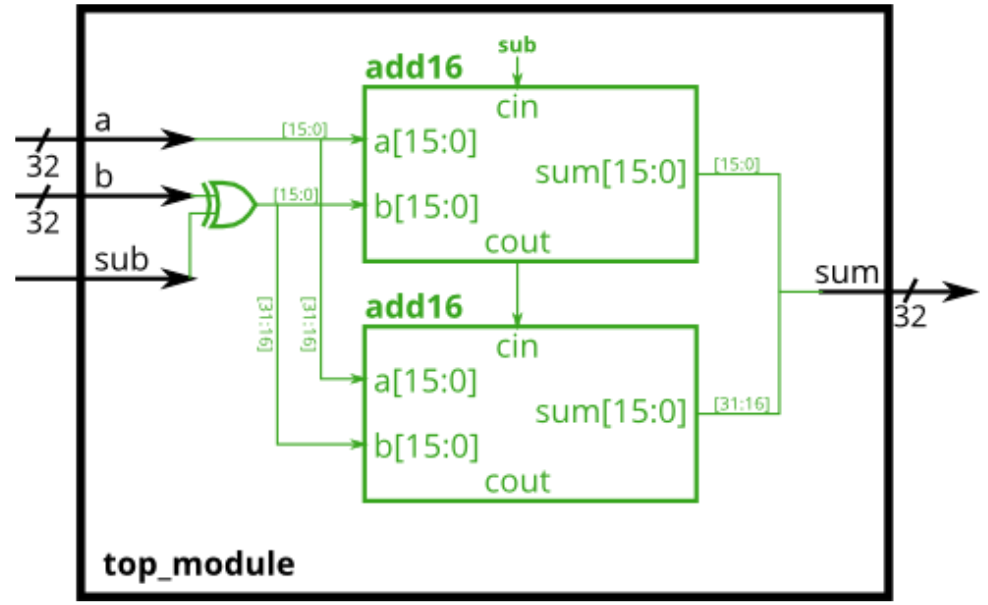

## 📌 Adder–subtractor

> Note: An XOR gate can also be viewed as a programmable inverter, where one input controls whether the other should be inverted. The following two circuits are both XOR gates:

> 

## 🧑‍💻 Code Example

### XOR gate
```verilog
module top_module(
    input [31:0] a,
    input [31:0] b,
    input sub,
    output [31:0] sum
);
    wire [31:0]xor_out;
    wire cout_lo, cout_hi_unused;

    // --- Option A: XOR Gate ---
    //assign xor_out = b ^ {32{sub}};

    // --- Option B: use programmable inverter ---
    assign xor_out = sub ? ~(b) : b;

    add16 adder_lo(.a(a[15:0]), .b(xor_out[15:0]), .cin(sub), .sum(sum[15:0]), .cout(cout_lo));
    add16 adder_hi(.a(a[31:16]), .b(xor_out[31:16]), .cin(cout_lo), .sum(sum[31:16]), .cout(cout_hi_unused));
endmodule
```

## 📚 Reference
* [HDLBits Problem - Module addsub](https://hdlbits.01xz.net/wiki/Module_addsub)
