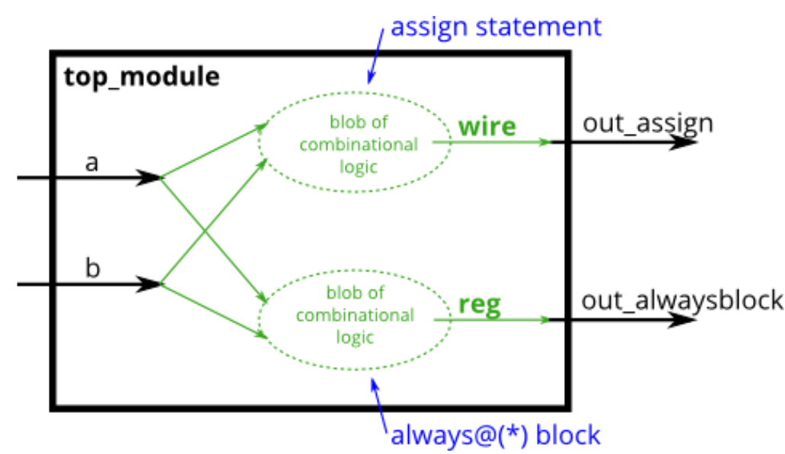
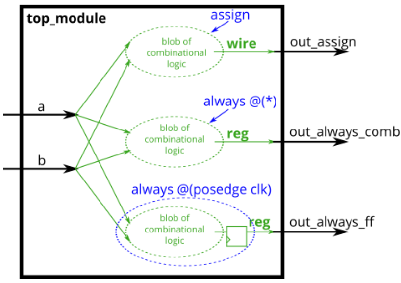

## 📌 Introduction

***Procedural Blocks*:** For ```always``` and ```initial``` blocks, they make statements execute like conventional software, ex: ```if-else```, ```case```, but cannot contain continuous ```assign``` statement.

### ```always``` Block
**Combinational**: It is equivalent to assign statement. Both are synthesized to the same circuit, declaration of ```wire``` or ```reg``` don't effect post-synthesization.

**Clocked**: Instead of responding with input immediately, it is typically trigered on clock posedge.

> In a combinational always block, use blocking assignments. In a clocked always block, use non-blocking assignments.

## 🧑‍💻 Code Example

### Combinational ```always``` Block
```verilog
module top_module(
    input a, 
    input b,
    output wire out_assign,
    output reg out_alwaysblock
);
	assign out_assign = a & b;
    always @ (*) begin
       out_alwaysblock = a & b; 
    end
endmodule
```

### Clocked ```always``` Block
```verilog
module top_module(
    input clk,
    input a,
    input b,
    output wire out_assign,
    output reg out_always_comb,
    output reg out_always_ff   );
    
    assign out_assign = a ^ b;
    always @(*) out_always_comb = a ^ b;
    always @(posedge clk) out_always_ff <= a ^ b;

endmodule
```

## 📚 Reference
* [HDLBits Problem - Alwaysblock1](https://hdlbits.01xz.net/wiki/Alwaysblock1)
* [HDLBits Problem - Alwaysblock2](https://hdlbits.01xz.net/wiki/Alwaysblock2)
